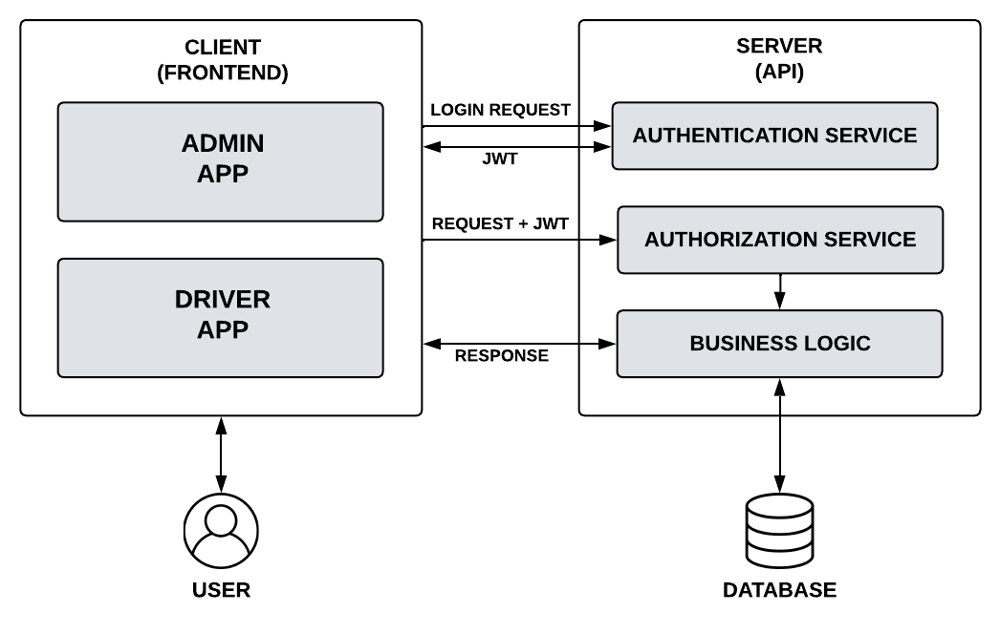
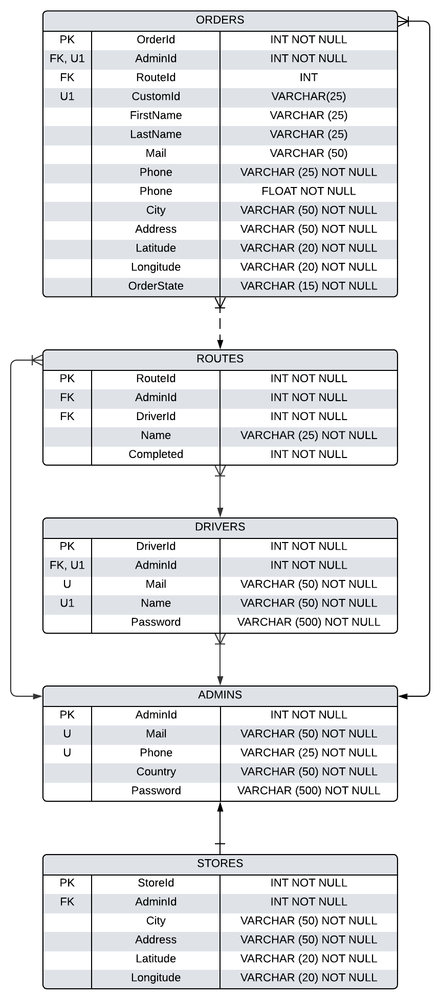
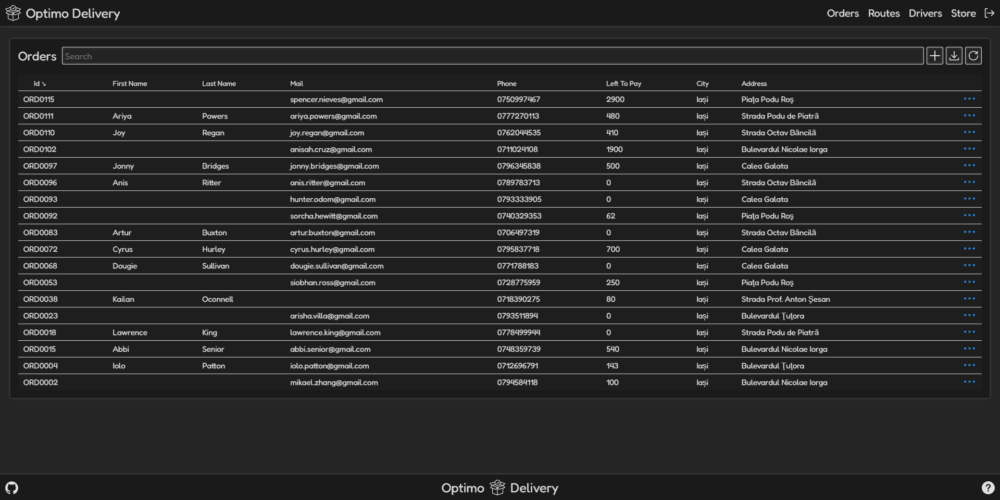
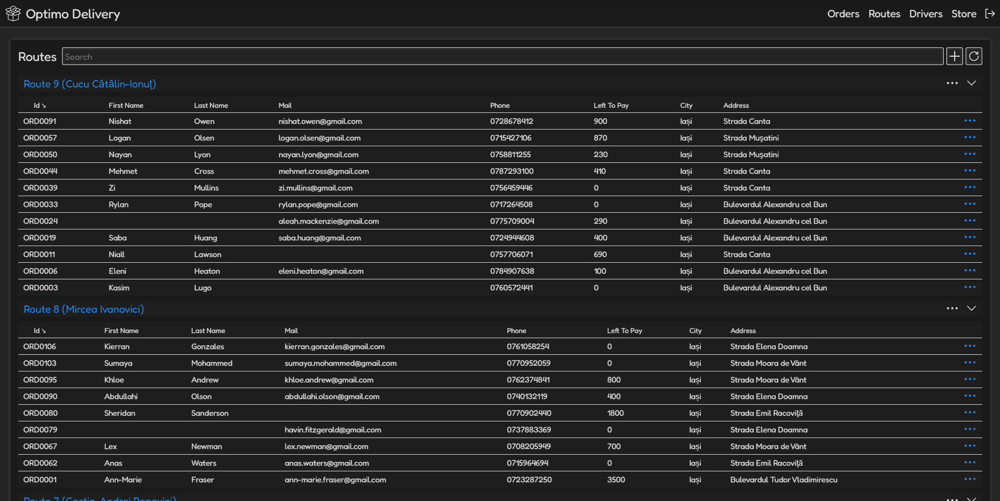
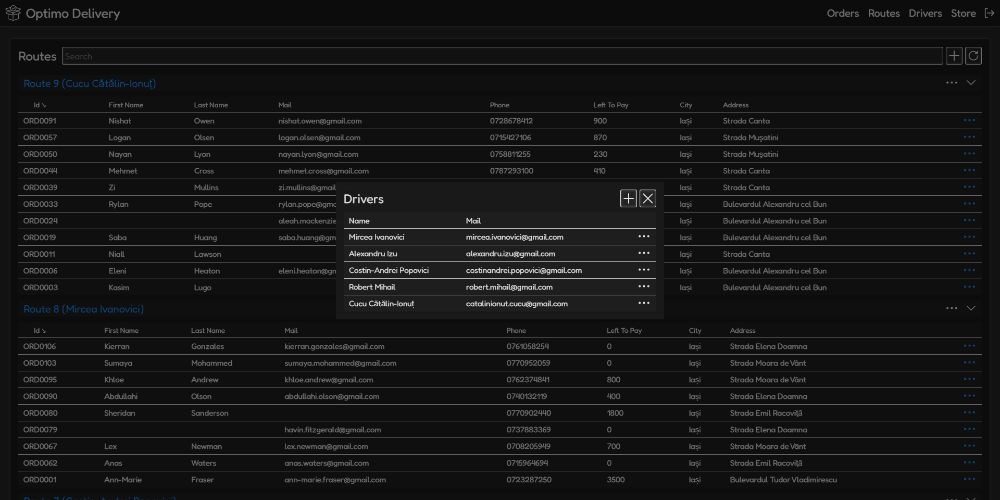
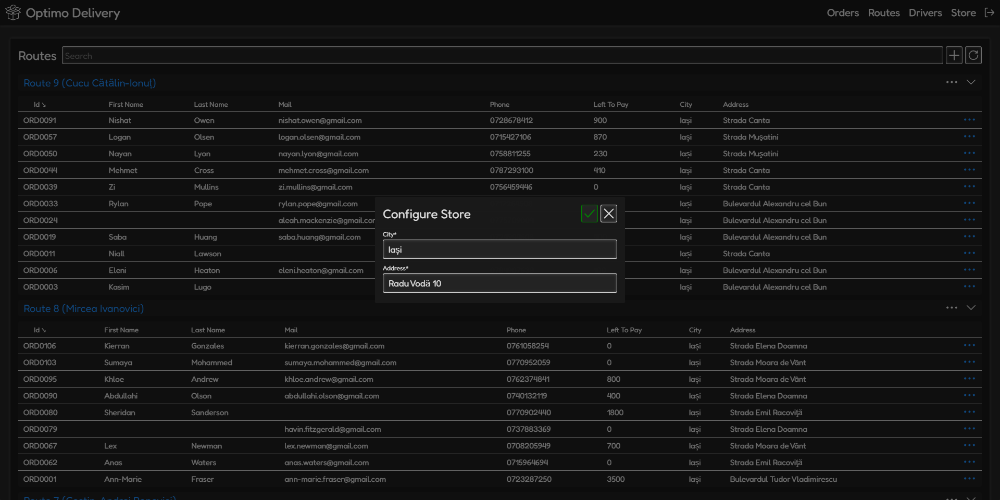

# Optiomo Delivery
Project for managing and delivering orders, the target consumers being small courier companies or small retail companies.

The project consists of an API that will deliver the data to the applications, for admins and for drivers. 

- The application for admins is for managing the orders by creating the orders, manually or through Excel files, planning the routes, manually or automatically, and creating the accounts for the drivers.

- The applications for drivers is for delivering the orders. Is kinda implemented but won't be part of the project for now. The UI is done, bar the GPS interface, but I didn't configure the controllers for the drivers.

## Architecture
The project is made after Client - Server architecture with user authentication and authorization using JWTs (JSON Web Token).

    

## API
API made with with APS.NET Core Web API (.NET 6).

### **Database**
Relational database, MS/SQL Server, that is accessed through EF6 (Entity Framework).

    

## Admin Application
Application made with APS.NET Core Blazor WebAssembly (.NET 6).

### **Excel order input**
In the Excel file, the first line must contain the name of the fields. The fields can be in any order and is not case sensitive but they must have the same names as below (any combinations are valid). The phone number, city, and address are mandatory fields because is the bare minimum information for delivering an order.

    

### **Automatic route planning**
A route is a set of orders that will be delivered, in a single ride, that is assigned to a driver.

In the below figure the nodes with the same color are planned routes. In the first image, the route is badly planned because the distance needed to visit all nodes is far bigger than any of the routes in the second image. So planning a route efficiently is very important because it minimizes the distance needed to deliver all orders.

    

The solution is to apply the K-Means algorithm multiple times. The user will specify how many orders a route should have, let's say X. Then the K-Means will be applied for a large number of clusters, where the clusters are small, down to a small number of clusters (at least 2), where the clusters are big. After the algorithm K-means is applied, if a cluster has at least X nodes, the algorithm stops. Why this? Because we can't tell for how many clusters the algorithm should be applied.

    

The maximum number of orders in an automatic planner route is 24 and the maximum number of clusters the K-means is applied for is 15. All these parameters will be specified by the user.

### **Screenshots**

    

    

    

    

    

    

## To Do
- Add the driver app that should:

    - Authenticate the drivers
    - Display the routes assigned to the drivers
    - Display the orders of the orders
    - Opmize the route (the order in which the orders should be delivered)
    - Offer GPS indications 

- Use some Maps API to validate the locations introduced and to optimize the route